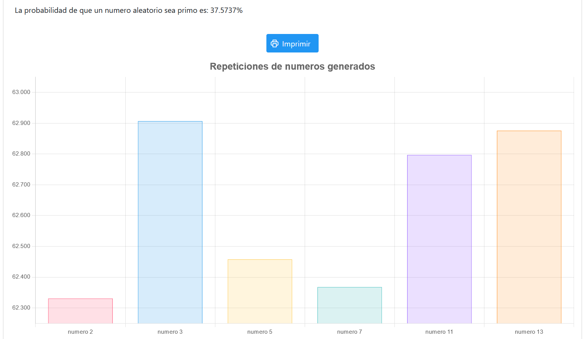
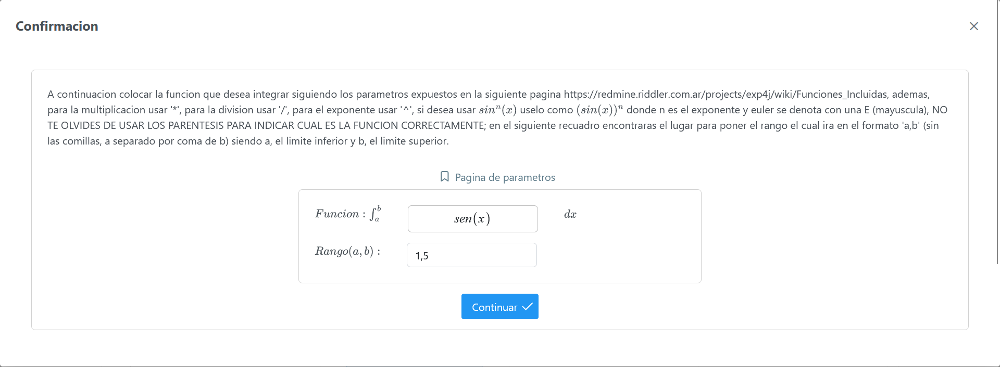

# MultiScience

MultiMath is a program created with Java using *JSF 3.0*, which fulfills a large number of mathematical and statistical applications. Mainly, it is focused on performing the experimental exercise [Montecarlo](https://es.wikipedia.org/wiki/M%C3%A9todo_de_Montecarlo), secondarily it can perform mathematical operations such as limits, derivatives, finite and indefinite integrals, and in statistics it has the ability to calculate the frequency table from an Excel template given by the program.

## How to run the program

To run the program it is recommended to use the Java IDE [Eclipse](https://www.eclipse.org/) in its Enterprise version, it is also required to use the Apache Tomcat server in its version 10.1 as a local server, in case you do not know how to use it, it is recommended to watch the following video.

## Screenshots of program execution

---

MultiMath es un programa creado con Java usando *JSF 3.0*, que cumple una gran cantidad de aplicativos matemáticos y estadísticos. Principalmente, se centra en la realización del ejercicio experimental [Montecarlo](https://es.wikipedia.org/wiki/M%C3%A9todo_de_Montecarlo), secundariamente puede realizar operaciones matemáticas tales como límites, derivadas, integrales de finidas e indefinidas, y en estadística tiene la capacidad de calcular la tabla de frecuencia a partir de una plantilla de Excel dada por el programa.

## Como ejecutar el programa

Para ejecutar el programa se recomienda hacer uso del IDE de Java [Eclipse](https://www.eclipse.org/) en su versión Enterprise, además se requiere hacer uso del servidor Apache Tomcat en su versión 10.1 como servidor local, en caso de que no conozca como hacer uso de este se recomienda ver el siguiente video.

## Capturas de ejecucion del programa

